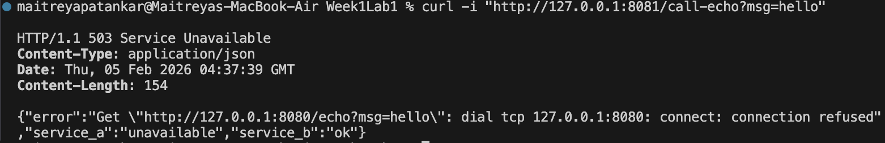

# How To Run

## Run Service A
```bash
cd service-a
go run .
```

## Run Service B (new terminal)
```bash
cd service-b
go run .
```

## Success Case
```bash
curl "http://127.0.0.1:8081/call-echo?msg=hello"
```


## Failure Case
```bash
curl "http://127.0.0.1:8081/call-echo?msg=hello"
```


## What makes this distributed?
This is a distributed system because Service A and Service B run as independent processes and communicate with each other using HTTP calls. Service B also depends on Service A through a remote call with a timeout, so if Service A is down, it results in a partial failure rather a than total application failure. The 503 error code returned when we stop Service A demonstrates this behavior.