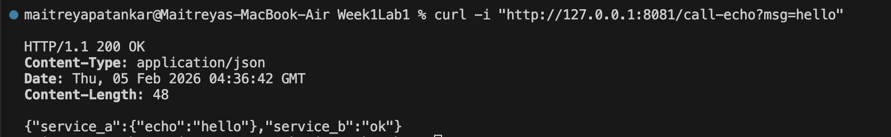
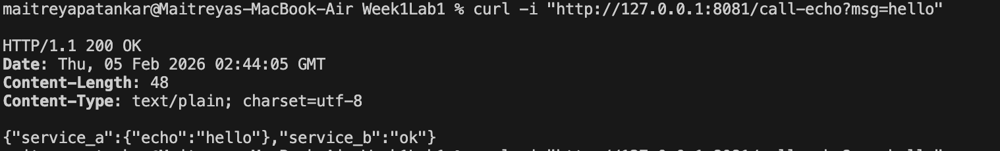

# How To Run

## Run Service A
```bash
cd service-a
go run .
```

## Run Service B (new terminal)
```bash
cd service-b
go run .
```

## Success Case
```bash
curl "http://127.0.0.1:8081/call-echo?msg=hello"
```


## Failure Case
```bash
curl "http://127.0.0.1:8081/call-echo?msg=hello"
```


## What makes this distributed?
This system is distributed because Service A and Service B run as independent processes and communicate over HTTP across the network interface (localhost). Service B depends on Service A through a remote call with a timeout, so failures like Service A being down result in partial failure rather than total application failure. The logs and 503 handling demonstrate how distributed systems must handle network unreliability and independent service failure.
